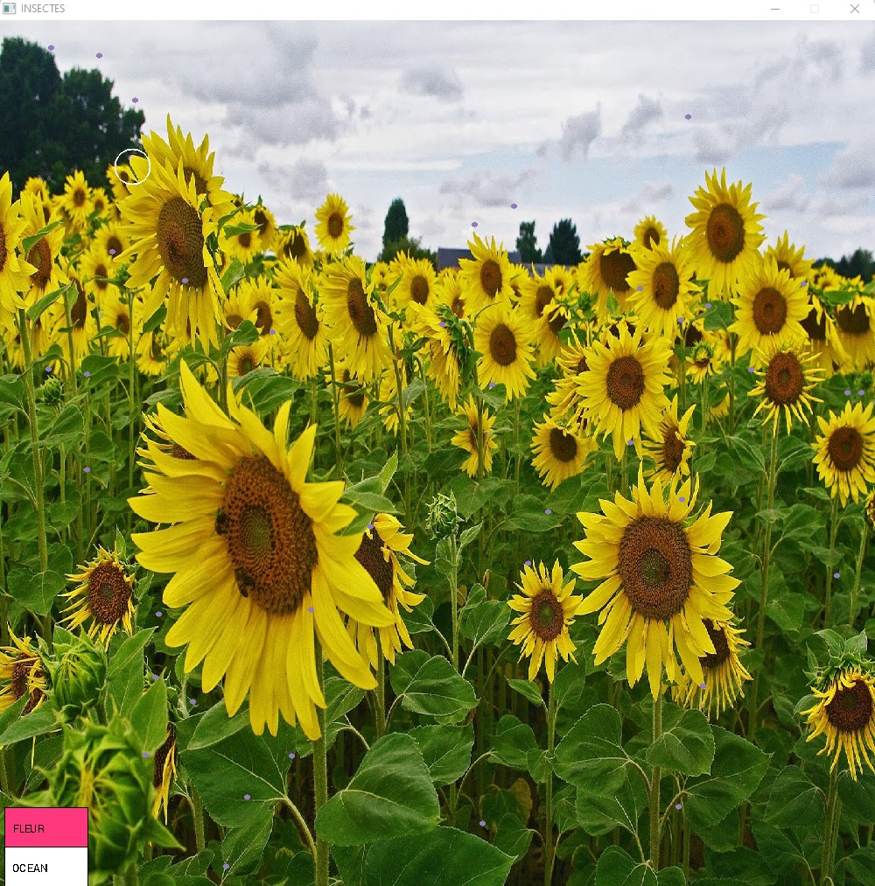
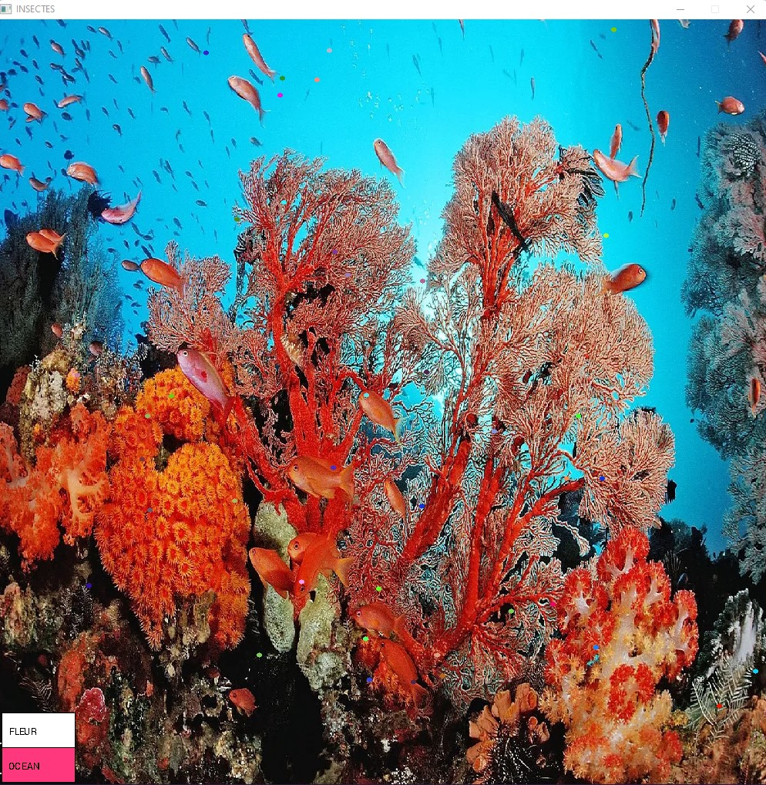

# Simulator Prey Predator Population

Mon objectif est de programmer un mini jeu où l’ordinateur « apprend » un camouflage pour
une population d’insectes se faisant dévorer par votre souris 🖱️​. La phase d’apprentissage est une
simulation de l’évolution génétique des gènes de couleur que pourrait faire une espèce
d’insectes voulant maximiser ses chances de survie.

2 Environnements sont disponibles:

CHAMPS:

Au debut tout les insectes ont des couleurs aleatoires


Apres quelques generations une couleur devient plus optimale pour moins etre visible et survivre 



OCEANS:

Idem ici ou les poissons ont des couleurs aleatoires au debut du programme



Puis la couleur s'uniforme au bout de plusieurs generations d'individus


# Play

Choisissez l'environnement dans le menu en bas a gauche (vous pouvez en rajouter facilement dans le code).

Puis mettez votre souris 🖱️​ sur les particules de couleurs que vous voyez pour les effacer.

Une fois que vous n'en voyez plus appuyez sur Space ​⌨️​ pour creer une nouvelles generation d'insecte.

Continuez jusqu'a voir quel couleur devient domminante !

# Subject

```
1. Un insecte est représenté par une position (x,y), une couleur (r,g,b), un temps de naissance
et une durée de vie. Une population d’insectes est représentée par un tableau de
NB_INSECTS insectes et une image de fond représentant le paysage dans lequel les insectes
vivent.

  Déclarez ces deux structures, ainsi qu’une structure Color munie des opérateurs
  d’addition, de soustraction, de multiplication et de division par un réel.

2. Écrivez les deux procédures suivantes d’initialisation du monde des insectes.

 void initInsect(SomeInsects& si, Color good, int range)
 - Initialise les insectes. Leur position est choisie au hasard. Leur couleur sera choisie
 au hasard dans un rayon range autour de la couleur good. Le champ de la durée de vie
 est initialisé à -1 : un chiffre négatif signifie que l’insecte est toujours vivant, un positif
 indique combien de temps il a vécu.

 void init(SomeInsects& si)
 - Initialise l’image du paysage et appelle la procédure qui initialise les insectes.

3. Écrivez la procédure draw qui prend en paramètre la population d’insectes et l’affiche, ainsi
que l’image de paysage. Chaque insecte est un cercle plein de rayon 3 avec la couleur stockée
dans la structure.

4. Écrivez la procédure Update avec 2 aspects : mort d’un insecte (question 5), régénération de
toute la population d’insectes (question 6).

5. Les insectes dans un rayon de 20 pixels de la souris sont mangés. La souris est le prédateur.
Un insecte mort n’est plus visible et aura son champ de durée de vie qui contiendra la durée
qu’il a vécu avant de se faire manger par la souris. Utilisez :
 ElapsedTime() qui renvoie la durée depuis le lancement du programme.

6. Une fois tous les insectes morts nous allons garder les insectes les mieux adaptés à leur
environnement, et sélectionner leur couleur pour régénérer une population.

 a. Écrivez la procédure minMaxLifeTime qui trouve la durée de vie minimale et la
 durée de vie maximale dans une population d’insectes.

 b. Écrivez la fonction averageColorOfGoodInsects qui calcule la couleur moyenne
 des insectes dont la durée de vie a été supérieure à une certaine durée.

 c. Dans une procédure update ajoutez du code qui régénère une nouvelle
 population avec une couleur mieux adaptée calculée par les questions a. et b.

```

# GrAPiC 

## Starting

Linux, Windows and Mac instruction :

http://licence-info.univ-lyon1.fr/grapic

## Introduction

GrAPiC is a small, easy-to-use framework to add graphical functionalities to your C/C++ code. 
Its main goal is to provide easy graphical functions to be used in introduction courses of algorithm and programming in C/C++. 
It is based on SDL2 but to use it you need to know only few very simples functions. 
The Grapic archive comes with the needed SDL part, you do not have to install SDL. Just unzip and enjoy ! 

## Starting

Compiling from the github (which is not the standard way).

* On Linux you need to install:
- g++
- doxygen
- zip
- lib-sdl2-dev lib-sdl2 sd2_image... sdl2_ttf...

1. sudo apt install g++ premake4 zip doxygen libsdl2-dev libsdl2-mixer-dev libsdl2-image-dev
2. make premake
3. make
(4. script/make_linux_test.sh): to test the archive doc/download/grapic-linux.tgz
(5. script/make_web.sh): to create the zip files in doc/download or to sync everything to the webpage (need passwd).


* On windows
0. Install CB 20
1. run premake-cb20.bat to generate the projects files    or     run premake-lifami.bat to generate lifami projects 
2. open build/windows-cb20/grapic.workspace

## Best way to make a projet in windows

(windows): 
 - Open build/windows-cb20/grapic.workspace in CodeBlocks
 - In the left part (Management) of the logiciel, double clic in the projet of yours choice (it's those in /apps)
 - Finally clic in the green arrow in the top of the screen


## Put your new project in GraPic

Add your directory with your cpp files in "apps" and add the path in "premake4".

